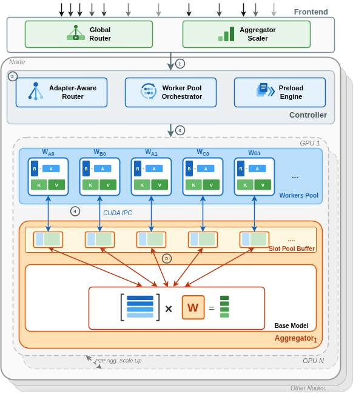
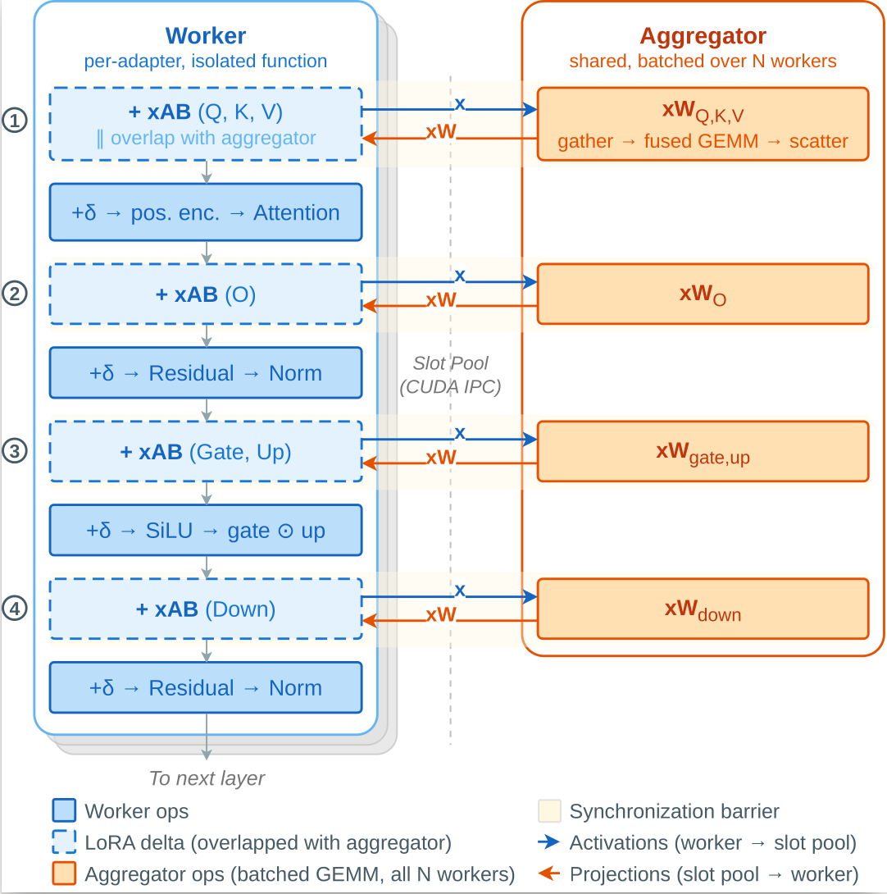
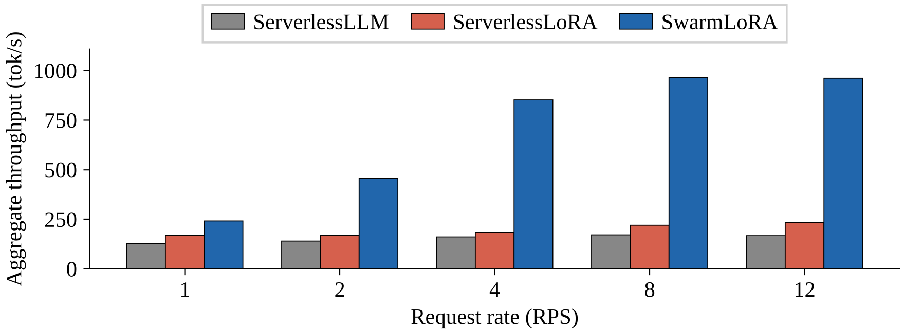
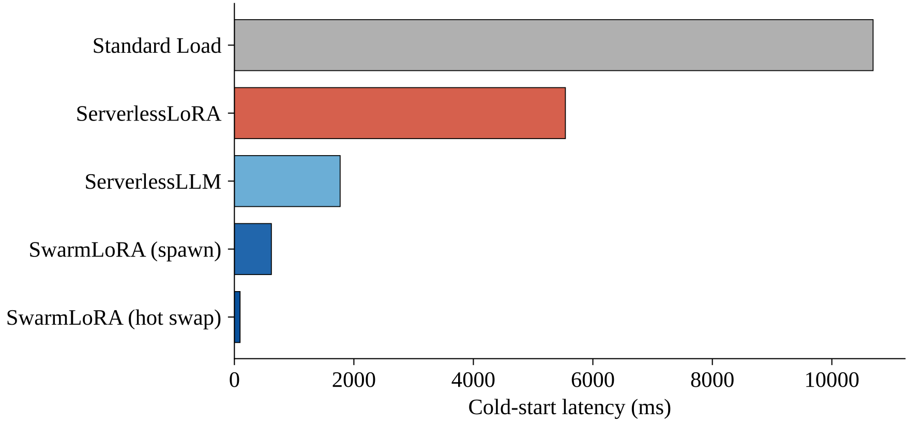
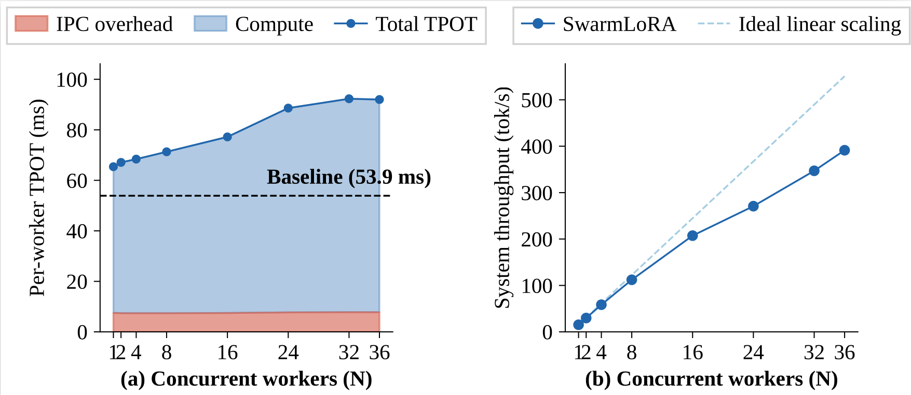

# SwarmLoRA

Multi-tenant LoRA serving forces a tradeoff. **Serverful** systems co-locate
every adapter in one process to batch efficiently, but a fault or memory leak
in one tenant can bring the whole process down. **Serverless** systems
isolate each adapter in its own function for safety, but every function then
recomputes the same shared base-model projection independently — the
isolation that protects tenants also throws away the GPU bandwidth that
batching would otherwise save.

SwarmLoRA is a disaggregated serverless architecture that gets both. A
persistent **aggregator** batches the base-model projection once across every
active adapter, while isolated **worker** functions each own a single
adapter's weights and KV cache and scale independently. Workers compute their
LoRA update locally, in parallel with the aggregator's batched matmul —
cross-adapter batching without breaking per-adapter isolation.

## Architecture
<p align="center">

</p>

Requests land at a **Global Router**, which spreads load across nodes while
an **Aggregator Scaler** brings up aggregators on demand. On each node, an
**Adapter-Aware Router** dispatches every request to the worker serving its
adapter, a **Worker Pool Orchestrator** manages worker lifecycle, and a
**Preload Engine** keeps cold starts fast. Workers and the aggregator never
share memory directly — they exchange activations through a pool of CUDA IPC
slots, one per in-flight request, so no tenant can read or write another's
data.

<p align="center">

</p>

Each transformer layer runs as four gather-scatter rounds (fused QKV, O,
Gate+Up, Down): every worker submits its activation to the slot pool, the
aggregator batches all of them into a single GEMM over the frozen base-model
weights, and scatters the results back. While that GEMM runs, each worker
computes its own LoRA delta locally — isolation runs in parallel with
computation instead of costing anything serially. Across a full forward pass
this adds up to roughly 130 such round-trips per generated token.

## Key Results

Measured on 4× NVIDIA L40S (single-node) and 2 nodes × 2×
NVIDIA A40 (cluster), Llama-3.1-8B-Instruct.

### Throughput and cold start

<p align="center">


</p>

**Left:** SwarmLoRA achieves **964 tok/s at 8 RPS** — 4.4× higher than ServerlessLoRA, 5.6× higher than ServerlessLLM.
**Right:** Worker spawn in **619 ms**, adapter swap in **95 ms** (6–7× faster).

### IPC overhead breakdown

<p align="center">

</p>

The split architecture adds **21.4% overhead** at N=1 (11.5 ms over
the 53.9 ms HF+PEFT baseline). At N=36 concurrent workers the system
reaches **391 tok/s** — a 21× improvement over single-worker inference.

### Trace-driven evaluation

| Trace category | TPOT P50 | Throughput |
|----------------|----------|------------|
| Steady-Light | 49 ms | 163 tok/s |
| Bursty-Light | 57 ms | 202 tok/s |
| Normal | 61 ms | 275 tok/s |
| Steady-Heavy | 67 ms | 835 tok/s |
| Bursty-Heavy | 80 ms | 795 tok/s |

### Adapter pool scalability

| Pool size | TTFT P50 | TPOT P50 | Swap Rate |
|-----------|----------|----------|-----------|
| 10 adapters | 308 ms | 82 ms | 34% |
| 100 adapters | 378 ms | 84 ms | 76% |
| 500 adapters | 406 ms | 87 ms | 89% |

TPOT stays flat across pool sizes — the base-model GEMM cost is
independent of adapter count.

## Quick Start

**Prerequisites**
- NVIDIA GPU(s) — the paper uses 4× L40S
- CUDA Toolkit 12.4, Python 3.9, CMake, GCC 11+

**Setup**
```bash
git clone https://github.com/SHUs-Lab/SwarmLoRA.git
cd SwarmLoRA
export HF_TOKEN=<your-huggingface-token>
bash scripts/setup.sh
```

## Analysis (Reproducibility)

Each script handles its own setup-to-cleanup lifecycle and writes JSON to
a `benchmark_results/` directory — under the repo root for SwarmLoRA, under
each baseline's own directory for the comparison systems. Each plot script
saves its figure as a PDF under `analysis/` (e.g. `analysis/rq1_throughput.pdf`)
— open it to view. One-time baseline setup, needed for the comparison figures:

```bash
bash baselines/serverlesslora/setup.sh
bash baselines/serverlessllm/setup.sh
```

**E1 — throughput vs. request rate:**
```bash
bash scripts/run_throughput.sh
bash baselines/serverlessllm/scripts/run_throughput.sh
bash baselines/serverlesslora/scripts/run_throughput.sh
python3 analysis/plot_rq1_throughput.py
```

**E2 — cold start and hot swap:**
```bash
bash scripts/run_cold_start.sh both 10
bash scripts/run_standard_load_cold_start.sh
bash baselines/serverlesslora/scripts/run_cold_start.sh
bash baselines/serverlessllm/scripts/run_cold_start.sh --prepare
bash baselines/serverlessllm/scripts/run_cold_start.sh
python3 analysis/plot_rq2_cold_start.py
```

**E3 — trace-driven evaluation (steady_heavy):**
```bash
bash scripts/run_trace_driven.sh steady_heavy
bash baselines/serverlessllm/scripts/run_trace_driven.sh --trace steady_heavy
bash baselines/serverlesslora/scripts/run_trace_driven.sh steady_heavy
python3 analysis/plot_rq3_trace.py
python3 analysis/plot_rq3_slo_cdf.py
```

SwarmLoRA-only, no baseline comparison:
- `bash scripts/run_scaling.sh` — throughput vs. concurrent workers (Fig. 2, motivation)
- `bash scripts/run_scalability.sh all` — adapter pool scalability, 10 to 500 adapters (Fig. 11; needs a 2-node cluster; see `src/controller/cluster/cluster.conf.example`)
- `bash scripts/run_overhead.sh` — IPC overhead breakdown vs. a single-process HF+PEFT baseline

## Additional Experiments

```bash
bash baselines/slora/setup.sh
bash scripts/run_security.sh
```

Per-adapter isolation evaluation against a co-located S-LoRA baseline.

## License

SwarmLoRA's own code (`src/`, `scripts/`, `benchmarks/`, `analysis/`,
`security_eval/`, `baselines/serverlesslora/`) is licensed under the
[Apache License 2.0](LICENSE); `baselines/serverlesslora/` is our own
reimplementation from the ServerlessLoRA paper's published design, not
vendored third-party code. The other bundled baselines under
`baselines/` retain their own original licenses (ServerlessLLM and
S-LoRA each ship their own `LICENSE` file). Replay traces under
`traces/` derive from third-party datasets — see `traces/README.md`.
