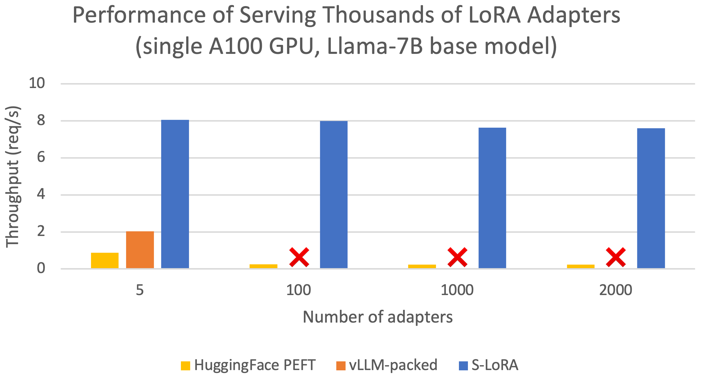
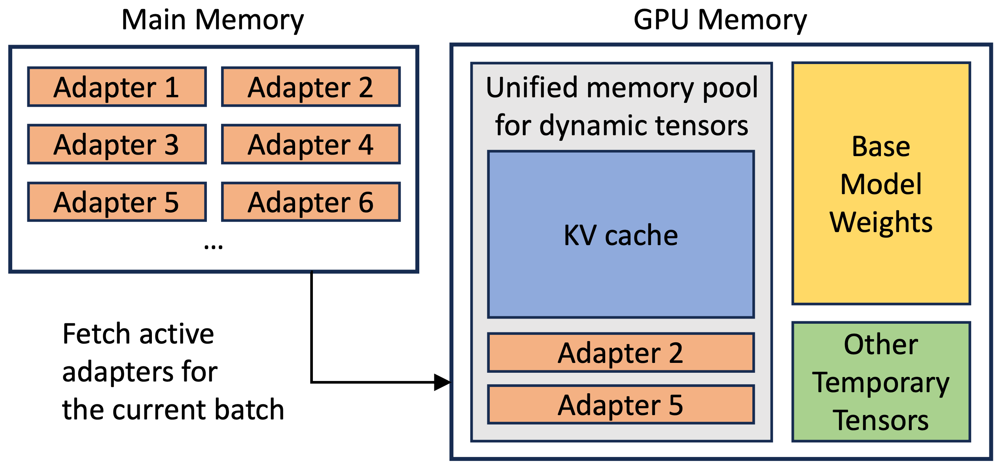
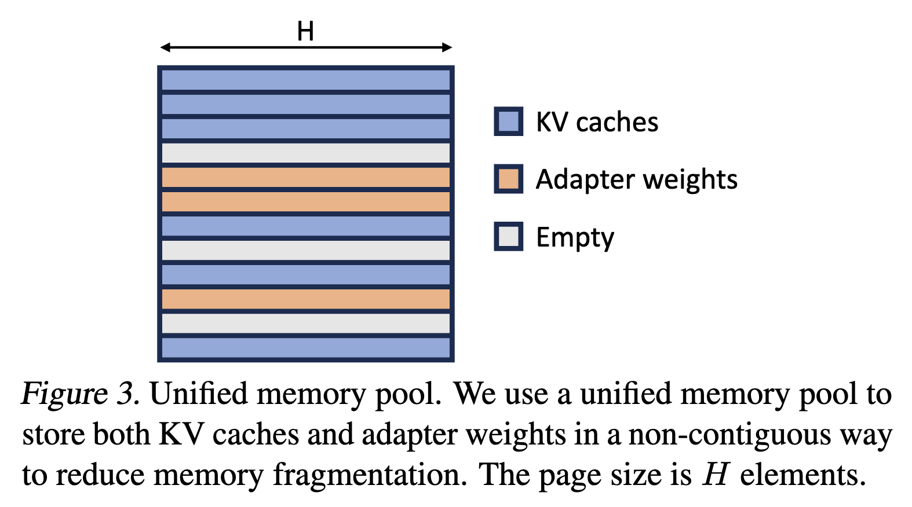
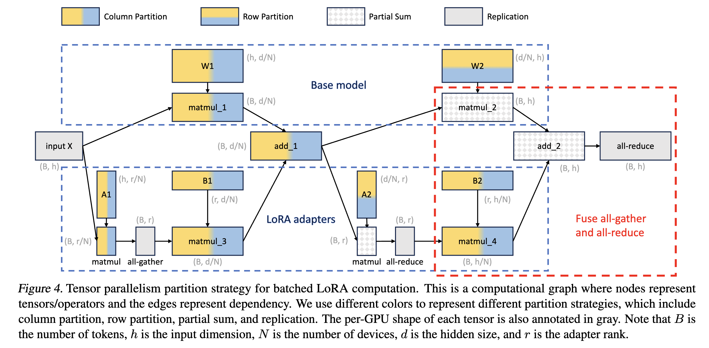
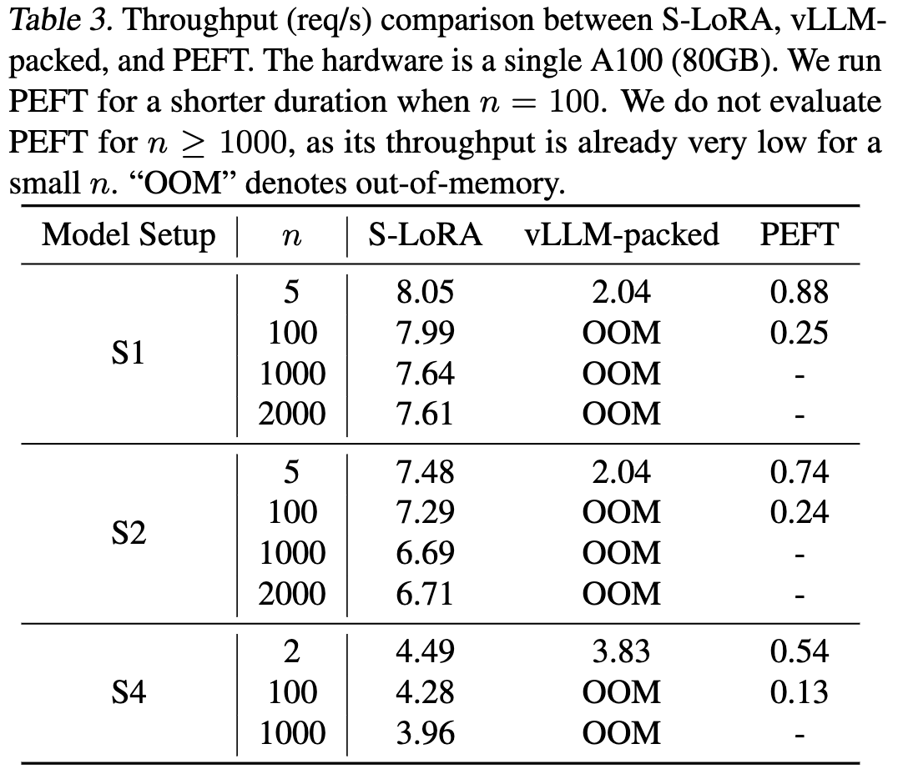
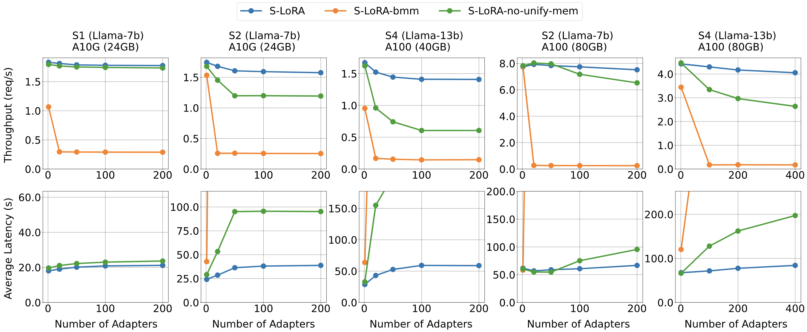
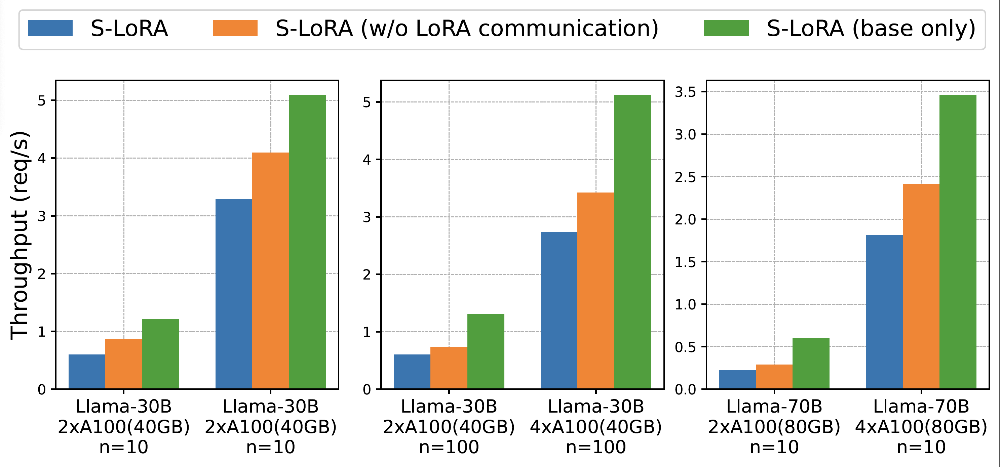

> **Note (SwarmLoRA artifact):** This is the serverful baseline used for the
> security isolation comparison in Table III (`scripts/run_security.sh`) and
> other evaluation figures. One-time setup (`setup.py` imports `torch` at
> parse time, so it must be installed before `-e .`; `--no-build-isolation`
> is required on the `-e .` step because pip's default isolated build
> environment can't see the venv's already-installed torch, causing
> `ModuleNotFoundError: No module named 'torch'`; `setuptools` must stay
> below 81 because newer releases dropped the bundled `pkg_resources`
> module that torch 2.0.1's `cpp_extension.py` imports at parse time,
> causing `ModuleNotFoundError: No module named 'pkg_resources'`;
> torch==2.0.1 has no wheel for Python >=3.10, so a 3.9 interpreter is
> installed via `uv` regardless of the system default; and torch 2.0.1 is
> compiled against CUDA 11.7, so building the CUDA kernel on any host with
> a newer CUDA toolkit (12.x/13.x) trips a build-time major-version-equality
> check that hard-fails with `RuntimeError: ... CUDA version ... mismatches
> ...` even though compiling against a newer host nvcc works fine in
> practice -- the patch below downgrades that check to the warning it
> already uses for minor-version mismatches; `setup.py` leaves
> `transformers`/`uvloop` unpinned and doesn't constrain `numpy`, so a fresh
> install pulls current releases that break this torch 2.0.1 / Python 3.9
> stack -- `numpy>=2` crashes modules compiled against numpy 1.x,
> `transformers>=4.32` refuses to import without `torch>=2.1`, and
> `uvloop>=0.18` removed the implicit event-loop creation the detokenizer
> relies on, so `numpy==1.26.4`/`transformers==4.31.0`/`uvloop==0.17.0` are
> pinned explicitly after the main install):
> ```bash
> bash baselines/slora/setup.sh
> ```
> Or manually:
> ```bash
> cd baselines/slora
> uv python install 3.9
> "$(uv python find 3.9)" -m venv venv
> venv/bin/pip install "setuptools<81" wheel
> venv/bin/pip install torch==2.0.1
> python3 - <<'PY'
> f = "venv/lib/python3.9/site-packages/torch/utils/cpp_extension.py"
> content = open(f).read()
> old = "            raise RuntimeError(CUDA_MISMATCH_MESSAGE.format(cuda_str_version, torch.version.cuda))"
> new = "            warnings.warn(CUDA_MISMATCH_MESSAGE.format(cuda_str_version, torch.version.cuda))"
> if old in content:
>     open(f, "w").write(content.replace(old, new))
>     print("patched CUDA version check")
> else:
>     print("pattern not found -- already patched or torch version changed")
> PY
> venv/bin/pip install --no-build-isolation -e .
> venv/bin/pip install "triton==2.1.0"
> venv/bin/pip install "numpy==1.26.4" "transformers==4.31.0" "uvloop==0.17.0"
> ```
>
> The two Table III S-LoRA-side experiments (`security_eval/malicious_adapter/slora/blind_attack_slora.sh`,
> `security_eval/fault/slora/runner.sh`) additionally need the real
> `huggyllama/llama-7b` base model (public, non-gated, ~26 GB) at
> `security_eval/malicious_adapter/slora/llama-7b`:
> ```bash
> venv/bin/huggingface-cli download huggyllama/llama-7b \
>     --local-dir ../../security_eval/malicious_adapter/slora/llama-7b
> ```
> This is separate from the Llama-3.1-8B-Instruct used by SwarmLoRA and the
> other baselines elsewhere in this artifact.
> The rest of this README is S-LoRA's own upstream documentation.

# S-LoRA: Serving Thousands of Concurrent LoRA Adapters [[paper](https://arxiv.org/abs/2311.03285)]

<p align="center">

</p>

---

*Latest News*
- A fair scheduler VTC ([paper](https://arxiv.org/abs/2401.00588)) has been integrated into S-LoRA.
  See file `slora/server/router/vtc_req_queue.py`.

---

## Abstract
The "pretrain-then-finetune" paradigm is commonly adopted in the deployment
of large language models. Low-Rank Adaptation (LoRA), a parameter-efficient
fine-tuning method, is often employed to adapt a base model to a multitude of
tasks, resulting in a substantial collection of LoRA adapters derived from one
base model. We observe that this paradigm presents significant opportunities
for batched inference during serving. To capitalize on these opportunities, we
present S-LoRA, a system designed for the scalable serving of many LoRA
adapters. S-LoRA stores all adapters in the main memory and fetches the
adapters used by the currently running queries to the GPU memory. To
efficiently use the GPU memory and reduce fragmentation, S-LoRA proposes
Unified Paging. Unified Paging uses a unified memory pool to manage dynamic
adapter weights with different ranks and KV cache tensors with varying sequence
lengths. Additionally, S-LoRA employs a novel tensor parallelism strategy and
highly optimized custom CUDA kernels for heterogeneous batching of LoRA
computation. Collectively, these features enable S-LoRA to serve thousands of
LoRA adapters on a single GPU or across multiple GPUs with a small overhead.
Compared to state-of-the-art libraries such as HuggingFace PEFT and vLLM (with
naive support of LoRA serving), S-LoRA can improve the throughput by up to 4
times and increase the number of served adapters by several orders of
magnitude. As a result, S-LoRA enables scalable serving of many task-specific
fine-tuned models and offers the potential for large-scale customized
fine-tuning services.

<p align="center">

</p>

## Requirements
* CUDA 11.8 compatible GPU
  * Recommended: GPUs from the Ampere family, like the A100, which support bfloat16 operations.
  * Note: Older GPUs from the Turing family like the T4, which do not support bfloat16, are not supported.
* 1.13 <= PyTorch <= 2.0.1

## Installation
```bash
conda create -n slora python=3.9
conda activate slora 
# Optional: Install CUDA via conda for a smoother installation experience,
# but you may need to manually set the Anaconda path variables.
# conda install cuda -c nvidia/label/cuda-11.8.0
# set environment variables: export TORCH_CUDA_ARCH_LIST="8.0 8.6"
pip install torch==2.0.1
pip install -e .
```
Make sure triton==2.1.0

For more details on installing CUDA via conda, refer to the [CUDA Installation Guide by NVIDIA](https://docs.nvidia.com/cuda/cuda-installation-guide-linux/index.html#conda-installation).

## Example Run

*(Upstream's own `benchmarks/` and `test/` example/demo scripts were trimmed
from this artifact -- see the note at the top of this README. They're
unrelated to how S-LoRA is actually used here.)*

In this artifact, S-LoRA is driven directly via `slora.server.api_server`
by the security-isolation scripts in `../../security_eval/` (see
`../../scripts/run_security.sh`), not via the upstream demo scripts.

## Methods

- Unified Paging: To reduce memory fragmentation and increase batch size, S-LoRA introduces a unified memory pool. This pool manages dynamic adapter weights and KV cache tensors by a unified paging mechanism.

<p align="center">

</p>

- Heterogeneous Batching: To minimize the latency overhead when batching different adapters of varying ranks, S-LoRA employs highly optimized custom CUDA kernels. These kernels operate directly on non-contiguous memory and align with the memory pool design, facilitating efficient batched inference for added LoRA computation.

- S-LoRA TP: To ensure effective parallelization across multiple GPUs, S-LoRA introduces a novel tensor parallelism strategy. This approach incurs minimal communication cost for the added LoRA computation compared to that of the base model. This is realized by scheduling communications on small intermediate tensors and fusing them with the communications of the base model.

<p align="center">

</p>

## Evaluation

### Settings

Model Settings:
| Setting | Base model | Hidden size | Adapter ranks |
|---|---|---|---|
| S1 | Llama-7B | 4096 | {8} |
| S2 | Llama-7B | 4096 | {64, 32, 16, 8} |
| S4 | Llama-13B | 5120 | {64, 32, 16} |
| S5 | Llama-30B | 7168 | {32} |
| S6 | Llama-70B | 8192 | {64} |

Baselines:

PEFT stands for HuggingFace PEFT: We build a server using it that batches single adapter requests and switches adapter weights between batches.

vLLM-packed: Because vLLM does not support LoRA, we merge the LoRA weights into the base model and serve the multiple versions of the merged weights separately. To serve m LoRA adapters, we run m vLLM workers on a single GPU, where multiple workers are separate processes managed by NVIDIA MPS.

S-LoRA-no-unify-mem: S-LoRA without the Unified Paging.

S-LoRA-bmm: S-LoRA without Unified Paging and customized kernels. It copies the adapter weights to continuous memory space and performs batched matrix multiplication with padding.

Please see our paper about the trace for synthetic workloads.

### Results

- We compare S-LoRA with both vLLM-packed and HuggingFace PEFT for serving many LoRA adapters.

<p align="center">

</p>

- Comparing with own variants.

<p align="center">

</p>

- We test the scalability of our tensor parallelism strategy.

<p align="center">

</p>

## Acknowledgment
SLoRA is build on top of [LightLLM](https://github.com/ModelTC/lightllm.git).

We also learned a lot from the following projects when developing S-LoRA.
- [punica](https://github.com/punica-ai/punica.git)
- [PEFT](https://github.com/huggingface/peft.git)
- [vLLM](https://github.com/vllm-project/vllm)

## Roadmap
- [ ] Release tensor parallelism implementation
- [ ] Clean up reproducible scripts
- [ ] More user-friendly API/frontend
- [ ] More model support

## Citation
```bibtex
@article{sheng2023slora,
  title={S-LoRA: Serving Thousands of Concurrent LoRA Adapters},
  author={Sheng, Ying and Cao, Shiyi and Li, Dacheng and Hooper, Coleman and Lee, Nicholas and Yang, Shuo and Chou, Christopher and Zhu, Banghua and Zheng, Lianmin and Keutzer, Kurt and Gonzalez, Joseph E. and Stoica, Ion},
  journal={arXiv preprint arXiv:2311.03285},
  year={2023}
}
```
```bibtex
@article{sheng2023fairness,
  title={Fairness in Serving Large Language Models},
  author={Sheng, Ying and Cao, Shiyi and Li, Dacheng and Zhu, Banghua and Li, Zhuohan and Zhuo, Danyang and Gonzalez, Joseph E and Stoica, Ion},
  journal={arXiv preprint arXiv:2401.00588},
  year={2023}
}
```
